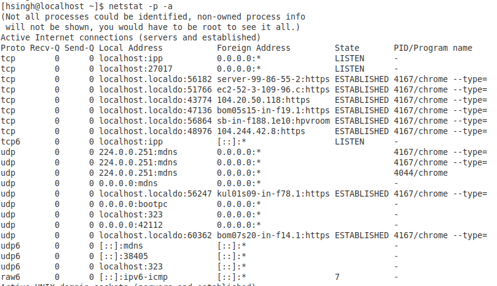

## Methods

1. Linux ping command
    
    -  min/avg/max/mdev ping values
    -   Flood ping
    -    Jitter
    
2. Monitoring
3. Response monitoring
    
    -    Report response changes
    -    Req res delay
    
4. Network congestion

## Detailed Proposal

1. **Linux ping command:** All Unix based system supports basic ping command right from their shell. This can be made into use by running it through a subprocess and pipe out the necessary details of our needs and scrap them accordingly. However, it is important to note that, ping works on the raw IP as a pong from the hosted service which runs as default in any network card. Hence, this method is just to check the server response time, requests performance and could be helpful in checking bottlenecking states. Following ways can make this process more helpful:
    
    -    **min/avg/max/mdev ping values:** These are the general ping values after the ping subprocess would end its successful execution. This can be made to run in count mode so that only a particular number of pings are made to the mentioned IP.
    
    

    -    **Flood ping:** These would send a high number of requests (often in thousands or lakhs) to the IP route specified. This leads to more accurate results but requires sudo if the minimum interval is set to < 0.2 (default). Consider the example below, the count is set to 10,000 requests with the interval set as 0 (since not mentioned) and hence requires sudo.
    
    

    -    **Jitter:** Jitter is the amount of variation in latency/response time, in milliseconds. Reliable connections consistently report back the same latency over and over again. Lots of variation (or 'jitter') is an indication of problems. Example: consider 5 ping samples: 136, 184, 115, 148, 125. Then, jitter found in the sample  can be calculated by averaging consecutive differences in the ping response time as follows: 136 to 184, diff = 48; 184 to 115, diff = 69; 115 to 148, diff = 33; 148 to 125, diff = 23; The total difference is 173 - so the jitter is 173 / 4, or 43.25. 
    
        
    
2. **Monitoring:** In a world of complex and sophisticated servers with several concurrent routes, monitoring remains an issue especially with the multi-deployment instance, handled by Kubernetes. This part aims to monitor the specific route and to alert the user in case of a downstate. 

3. **Response Monitoring:**
    -    **Report changes:** Extension of the above point, in which the response of the particular route would be saved as a time-series and a mean of the response length would be saved on each incoming request. On each response, the per-cent change in the response length would be compared to the mean length of the response of that route. If the change is beyond a threshold, an alert will be sent to the user, since a change beyond the threshold would indicate some error in the VM.
    -    **Req-Res delay:** The delay or increase on the req-res time would lead to more likeliness of a request being a timeout and hence a bad performance functionally and non-functionally as well. The report changes monitoring method can be integrated in this module since we are dealing with routes and requests, so there is no sense to create another module for the cause.
    
**Note:** We have to create a separate database to store the values of response length to reuse it next time the user starts bench-routes.
    
4. **Network Congestion:** Network Congestion is the situation that occurs when the entire bandwidth of the network is occupied. For better understanding, consider a water flow pipe. When the water in the pipe has the highest Reynold number (in the situation of highest pressure output), the pipe can be said to be congested, i.e., any other stream of water cannot be passed through it. A network can be related in the same way. Hence, any request in a congested network will be bound to get slow and sometimes may lead to time-out, resulting in termination of operations.
Checking congestion in a network can be carried out by using **netstat**. The following is sample output from the netstat command.

   

   Note the columns **Recv-Q** and **Send-Q**. These two are the most important. The numbers in the two columns represent the **leftover packets.** Let's understand what **leftover packets** are.

   In any system, **Recv-Q** and **Send-Q** are sockets which are responsible for inbound and outbound connections. Consider them as buffers. Whenever any program has to send information to the external network (or internet), the information is broken down into small transferable packets that are atomic in nature. These packets are then sent to **Send-Q** buffer. In **Send-Q** buffer, the packets are queued and the initial link is established to the corresponding foreign address. Once the link is established, these packets are then transferred one after another (serially) and removed from the buffer. Naturally, those packets which could not be transferred to the foreign address (or external network) would be leftover in the buffer. This could be due to various reasons, the most common and important being the congestion of outgoing network bandwidth. 

   Similarly, when a packet is received by the system, it gets stored in the **Send-Q** buffer. Once the storing of the batch of incoming packets is done, the requested listening programs are signaled the arrival of the requested packets. These programs then collect the required packets. Ideally, the programs should collect all the packets from the buffer which they have requested while sending from the **Send-Q** buffer unless some internal error has occurred in the program.  This leads to leftover packets in the **Recv-Q** buffer and hence indicates some issue in the internal network (or local network or localhost).

   Hence, it must be clear by now, that for the successful execution of a request-response cycle, the **Recv-Q** and **Send-Q** must show values of 0 (i.e., 0 leftover packets in the respective buffer). Now about the implementation. This approach can be done on the host system only. Hence, we need to make an independent script that would be deployed on the host server and that would be listening on some port X. Bench Routes would ping X in regular intervals to collect data and analyze whether the server is in congested state of network or not. It is obvious to have doubt that if in case the network is already congested, the ping to X might time out. Yes, that's true. To avoid this situation, the request needs to be highly optimized. Moreover, this timeout will itself indicate the congestion and once the congestion improves, the stats or reason could be studied from the PID or PName (as in the event of failure, the benchroute would still continue to ping until a response is received. Once the response is received, the entire picture will become clear).
