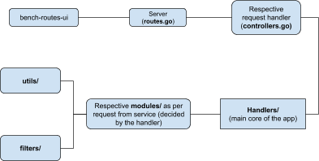

## Data Flow

*Please read this as a continuation of the [**High-Level Model.**](doc3.md)*

The flow of data right from the requesting the bench-routes service by the front UI until the final response to the front UI is as follows. (All lines indicate bi-directional propagation, and / indicates a directory as related with the **High-Level Model**)

## Implementation

The implementation of the above-proposed idea would be carried out in the Go programming language. This project will launch itself on boot and work as a daemon service. The benchroutes-UI, an electron app(would be later discussed), will be responsible for the graphical aspect of the project.